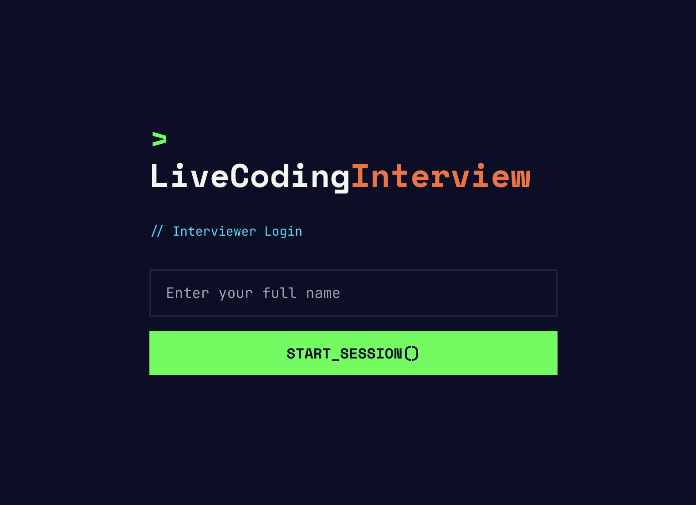

# LiveCoding Interview Platform

A real-time collaborative platform for conducting technical coding interviews with live code execution and evaluation.

## Features

<a href="https://youtu.be/ODW5OJCgh_k"></a>

### For Interviewers
- 🎯 Create custom interview sessions with difficulty levels (Junior/Middle/Senior)
- 📝 Select from pre-loaded coding problems or add custom ones
- 👀 Real-time view of candidate's code with syntax highlighting
- ▶️ See code execution results in real-time
- ⭐ Evaluate solutions with ratings and comments
- 🔗 Generate unique session links for candidates

### For Candidates
- 💻 Write code in Monaco Editor with full Python support
- 🚀 Run code directly in browser using Pyodide (WebAssembly)
- 🔄 Real-time synchronization with interviewer
- 📊 Track progress through multiple problems
- ✨ Receive thank you message with inspirational quote

### Technical Highlights
- **Real-time sync**: WebSocket-based code synchronization
- **In-browser execution**: Python code runs client-side via Pyodide
- **Neo-Brutalist UI**: Modern, technical design aesthetic
- **Comprehensive testing**: 109 tests (65 frontend + 44 backend)
- **Production-ready**: Docker containers, CI/CD pipeline, health checks

## Technology Stack

### Frontend
- **Framework**: Vue.js 3 with Composition API
- **State Management**: Pinia
- **Code Editor**: Monaco Editor (VS Code editor)
- **Styling**: TailwindCSS with custom Neo-Brutalist theme
- **Code Execution**: Pyodide (Python in WebAssembly)
- **Testing**: Vitest + Vue Test Utils (65 tests)

### Backend
- **Framework**: FastAPI (Python 3.11)
- **Package Manager**: UV (fast Python package installer)
- **Database**: PostgreSQL with SQLAlchemy
- **Migrations**: Alembic
- **Real-time**: WebSocket for live synchronization
- **Testing**: Pytest + pytest-asyncio (44 tests)

### DevOps
- **Containerization**: Docker with multi-stage builds
- **CI/CD**: GitHub Actions
  - Automated testing
  - Code linting (Ruff, ESLint)
  - Security scanning (Gitleaks)
  - Docker image building
- **Code Quality**:
  - Backend: Ruff (linter + formatter), MyPy (type checking)
  - Frontend: ESLint, Prettier

## Quick Start

### Prerequisites
- Docker and Docker Compose
- Git

### Development Setup

1. **Clone the repository**
   ```bash
   git clone https://github.com/YOUR_USERNAME/livevibecoding.git
   cd livevibecoding
   ```

2. **Start all services**
   ```bash
   docker compose up
   ```

3. **Access the application**
   - Frontend: http://localhost:5173
   - Backend API: http://localhost:8000
   - API Documentation: http://localhost:8000/docs

4. **Run database migrations**
   ```bash
   docker compose exec backend alembic upgrade head
   ```

### Running Tests

```bash
# Run all tests
./run-tests.sh

# Backend only
./run-tests.sh --backend-only

# Frontend only
./run-tests.sh --frontend-only
```
